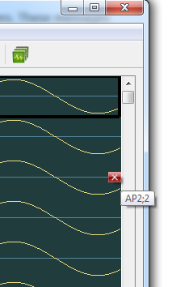

## File Viewer

* View any SpikeGLX output data (`bin`) file.
* Time-lock (`link`) views across data streams.
* Export subsets of the data to new bin or text files.

### Run Anywhere

Compiled SpikeGLX releases contain two executables:

```
    SpikeGLX.exe        Full function, but needs NI-DAQmx software
    SpikeGLX-NISIM.exe  Full Imec function, simulated NI
```

SpikeGLX-NISIM.exe is provided so you can:

* Run Imec acquitision when you don't have/need NI hardware.
* Run the File Viewer anywhere without NI hardware.

### Opening a Viewer

From main console window, choose `File/Open File Viewer` then select
any SpikeGLX `bin` file.

You can open several files, one Viewer for each.

>You can view files from different runs at the same time. Linking is
smart and only connects files within the same run.

### Viewer Titlebar

This shows the name of the open file, its channel count,
the sampling rate, and some useful time information:

* t0 = Seconds elapsed between the start of the run and the first
sample in this file. The first sample received from that stream's hardware
defines T=0.

* dt = Total time span of this file (in seconds).

>Note: Each Viewer is listed in the console `Window` menu. Select
a window here to bring it front.

### Linking (Time Axes)

Linked viewers send messages to each other so actions in one
automatically update the others. These messages are passed:

* Time range changed.
* Time axis scrolled.
* Time selection changed (Shift-click and drag).

To turn linking on, choose Viewer menu item `File::Link (Ctrl+L)`.
The menu item toggles to `Unlink`. The currrent Viewer's context
will be propagated to the other windows.

You can only link files of the same run. You can only link them if their
`bin` and `meta` files are all stored in the same directory. Said another
way, the path and file base name `myRun_gXXX_tYYY` are the association keys.

### Auto-open

Any time you initiate linking and there are no other files in that run
currently open, the software will first open all the associated files
it can find and then link them. This saves the steps of manually using
the Open command several times.

Note that unlinking never closes windows.

### Unlinking

When linking is on, scrolling in one window causes scrolling in other
windows which is normally what you want, but if you're mostly looking
at a particular file it will certainly slow you down. You can scroll
faster like this:

1. Turn linking off (Ctrl+L).
2. Navigate manually (the windows are now independent).
3. Make sure the view of interest is the frontmost window.
4. Turn linking back on (Ctrl+L) in that window; the others
will sync up to it.

### Exporting a Subset of the Data

Open the `Export dialog` by: choosing `File::Export`, or pressing `Ctrl+E`,
or `right-clicking` anywhere in the graph area.

The dialog offers several choices for the range of graphs (channels)
to include and for the time span to include.

The next two sections explain how to graphically specify these selections
**before opening the Export dialog**.

### Selecting Channels to Show or Export

You can remove uninteresting channels from the view in two ways:

1. In the `Channels` menu, toggle that channel off (uncheck it).
2. Hover the cursor (mouse) over the right edge of the desired
graph at its baseline (y=0). A red `X` will appear. Click this
to remove the channel.



Channels can be restored in the Channels menu by toggling them on or
choosing `Show All`.

### Selecting Time Ranges

You can use click-and-drag to graphically select a time range either
to zoom the current view, or to set a range for the export function.

* To zoom, hold down the **Ctrl** key on the initial left-click.
* For export, hold down the **Shift** key as you left-click.

For either type of drag operation the window will automatically scroll
if you move the mouse beyond the right or left edge of the window.

* You may need to wiggle the mouse a bit to make it scroll.
* You don't have to keep the modifier key down after you start dragging.
* You can erase an export range by Shift-left-clicking without dragging.
* The `Status` area at the bottom includes an export selection readout.

### Right-Clicking

`Right-click` anywhere in the graph area to get a menu of additional
features.

#### ShankMap Operators

Only spiking channels have an associated entry in the stream's shankMap.
The shankMap describes the location of the sensing electrode that's
connected to each channel, and if that channel should be included in
spatial averaging `-<S>` operations. Bad channels diminish the effectiveness
of spatial averaging...

* `ShankMap: Toggle This Chan`: Right-click on a spiking channel,
then select this option to turn that channel off/on.

* `ShankMap: Turn Off List`: A dialog appears to name groups of channels.

* `ShankMap: Restore Original`: Revert to the shankMap stored in the meta
file. The stored shankMap automatically turns off *reference* channels,
*standby* channels, and any *custom* channels you marked when configuring
the run.

> **Note**: None of these shankMap editing operations permanently alter
the on-disk metadata.

#### Export

* `Export`: This is a quick way to get the Export dialog after selecting
a time range.

### Performance Tips

Navigating is faster if less work is needed to update the view(s).

* Unlink when you don't need it.
* Scrolling gets much faster/smoother as you reduce the time span.
* Try browsing with a short span, then increase it for context.
* Uncheck filters you don't need.
* Try selecting the manual graph updating mode from File::Time Scrolling.
(*In this mode you can manipulate the time start/slider controls and graphs
won't redraw until you click the 'Update' button next to the slider*).


_fin_

