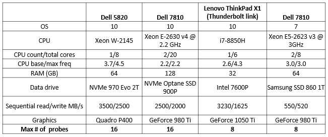

## System Requirements for PXI

### Overview

Computer requirements depend upon the number of probes and other signals
to be acquired in an experiment. Heavy use of the visualization tools
during acquisition are an additional burden. Since a single computer
specification won't cover all uses of SpikeGLX, we give some rough
guidelines and examples of systems we have tested.

#### New Purchase Guidelines

The following are what we think you should purchase if buying a new
desktop machine for this application.

__Up to 8 probes, plus NI channels:__

* Windows 7 or 10, 64-bit
* NI Platform Services 18.5 or later
* NI-DAQmx 18.6 or later
* Minimum 6 cores (Passmark rating > 13000)
* Minimum 3.5 GHz
* Minimum 16GB memory
* Graphics Card: Nvidia GeForce 1060 or better (see, e.g. Passmark ratings for video cards)
* Dedicated data drive (SSD or NVMe, 500+ MB/s)
* PCIe 8X slot for the PXIe controller

__Up to 16 probes, plus NI channels:__

* Windows 7 or 10, 64-bit
* NI Platform Services 18.5 or later
* NI-DAQmx 18.6 or later
* Minimum 8 cores (Passmark rating > 18000)
* Minimum 3.5 GHz
* Minimum 32GB memory
* Graphics Card: Nvidia GeForce 1060 or better (see, e.g. Passmark ratings for video cards)
* Dedicated data drive (NVMe 2000+ MB/s write rate)
* PCIe 8X slot for the PXIe controller

Notes

* GeForce cards require PCs with 400W power supplies
* Google '_model_name_ passmark' (e.g. W-2145 passmark)
* The data drive should be distinct from the system drive

#### Testing Existing Hardware

In SpikeGLX select menu item `Window\Run Metrics` to display a window
of performance measurements that provide some insight on whether the system
is running comfortably or struggling to keep up.

#### Our Test Systems

The following are systems we've tested in our lab. These are not
recommendations (most of the hardware is no longer available);
they are illustrations of working systems.

More work needs to be done to better understand which system attributes
are the most significant.

_fin_

